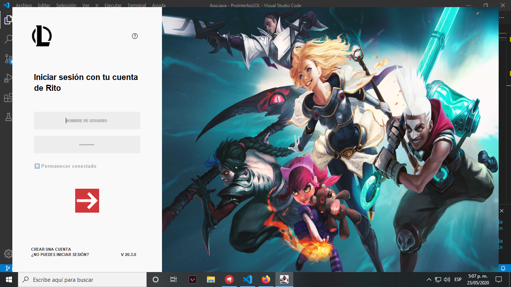

# Actividad # 4 - Modularizacion de codigo

## Josue Nuñez Prada

Este repositorio contiene el codigo de la cuarta actividad, correspondiente la modularizacion de codigo para un mejor desarrollo y mantenimiento del proyecto

